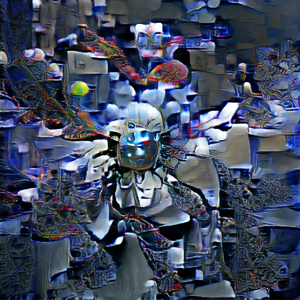
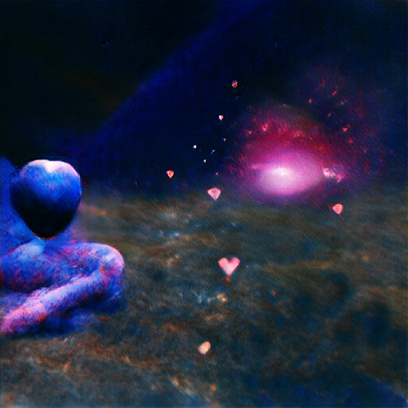
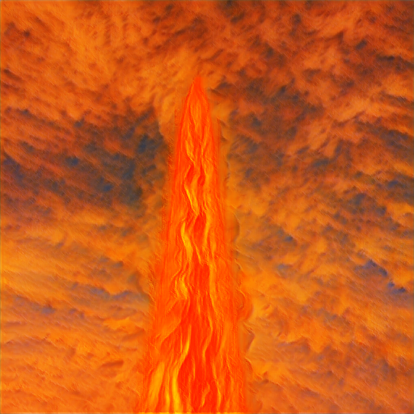
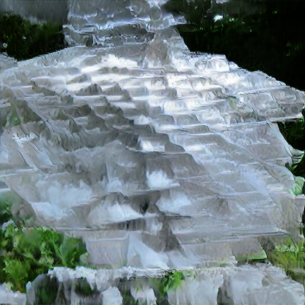
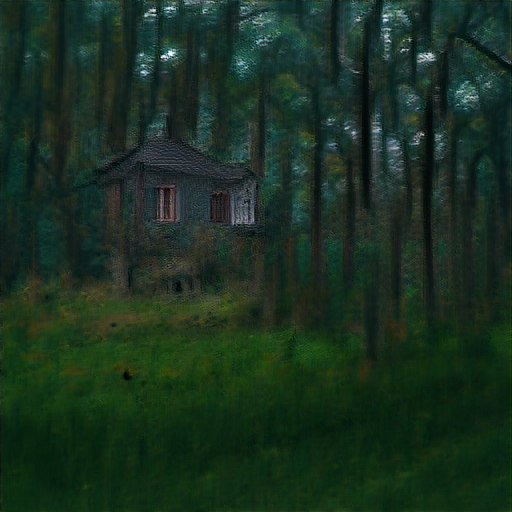
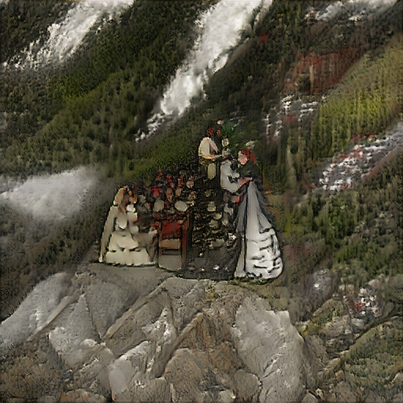
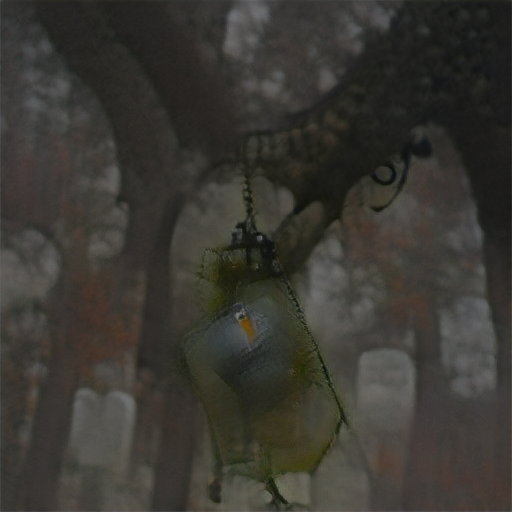
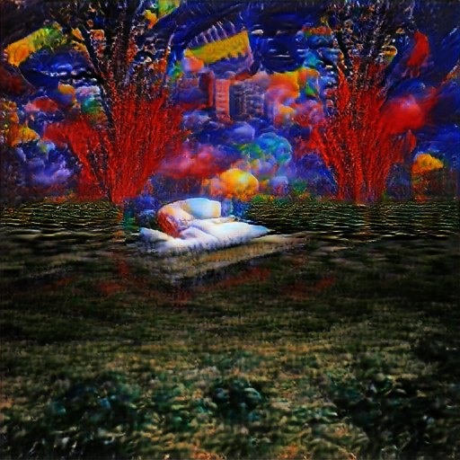
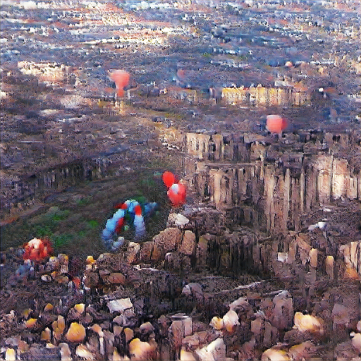

</img>

*artificial intelligence*

</img>

*cosmic love and attention*

</img>

*fire in the sky*

</img>

*a pyramid made of ice*

</img>

*a lonely house in the woods*

</img>

*marriage in the mountains*

</img>

*lantern dangling from a tree in a foggy graveyard*

</img>

*a vivid dream*

</img>

*balloons over the ruins of a city*

## Big Sleep

<a href="https://twitter.com/advadnoun">Ryan Murdock</a> has done it again, combining OpenAI's <a href="https://github.com/openai/CLIP">CLIP</a> and the generator from a <a href="https://arxiv.org/abs/1809.11096">BigGAN</a>! This repository wraps up his work so it is easily accessible to anyone who owns a GPU.

You will be able to have the GAN dream up images using natural language with a one-line command in the terminal.

Original notebook [![Open In Colab][colab-badge]][colab-notebook]

Simplified notebook [![Open In Colab][colab-badge]][colab-notebook-2]

[colab-notebook]: <https://colab.research.google.com/drive/1NCceX2mbiKOSlAd_o7IU7nA9UskKN5WR?usp=sharing>
[colab-notebook-2]: <https://colab.research.google.com/drive/1MEWKbm-driRNF8PrU7ogS5o3se-ePyPb?usp=sharing>
[colab-badge]: <https://colab.research.google.com/assets/colab-badge.svg>

## Install

```bash
$ pip install big-sleep
```

## Usage

```bash
$ dream "a pyramid made of ice"
```

Images will be saved to whereever the command is invoked

## Advanced

You can invoke this in code with

```python
from big_sleep import Imagine

dream = Imagine(
    text = "fire in the sky",
    lr = 5e-2,
    save_every = 25,
    save_progress = True
)

dream()
```

You can also set a new text by using the `.set_text(<str>)` command

```python
dream.set_text("a quiet pond underneath the midnight moon")
```

And reset the latents with `.reset()`

```python
dream.reset()
```

To save the progression of images during training, you simply have to supply the `--save-progress` flag

```bash
$ dream "a bowl of apples next to the fireplace" --save-progress --save-every 100
```

Due to the class conditioned nature of the GAN, Big Sleep often steers off the manifold into noise. You can use a flag to save the best high scoring image (per CLIP critic) to `{filepath}.best.png` in your folder.

```bash
$ dream "a room with a view of the ocean" --save-best
```

## Experimentation

You can set the number of classes that you wish to restrict Big Sleep to use for the Big GAN with the `--max-classes` flag as follows (ex. 15 classes). This may lead to extra stability during training, at the cost of lost expressivity.

```bash
$ dream 'a single flower in a withered field' --max-classes 15
```

## Alternatives

<a href="https://github.com/lucidrains/deep-daze">Deep Daze</a> - CLIP and a deep SIREN network

## Used By

- <a href="https://dank.xyz/">Dank.xyz</a>

## Citations

```bibtex
@misc{unpublished2021clip,
    title  = {CLIP: Connecting Text and Images},
    author = {Alec Radford, Ilya Sutskever, Jong Wook Kim, Gretchen Krueger, Sandhini Agarwal},
    year   = {2021}
}
```

```bibtex
@misc{brock2019large,
    title   = {Large Scale GAN Training for High Fidelity Natural Image Synthesis}, 
    author  = {Andrew Brock and Jeff Donahue and Karen Simonyan},
    year    = {2019},
    eprint  = {1809.11096},
    archivePrefix = {arXiv},
    primaryClass = {cs.LG}
}
```
